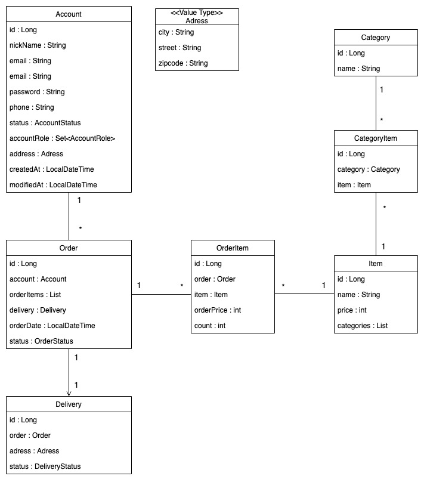

## Open Market Project
- Commerce 가 제공하는 기능들을 직접 구현함으로써 Commerce 도메인을 이해
- 대규모 트래픽에도 견고한 어플리케이션을 구현
- 논리적이고 이해하기 쉬운 코드
- 유지보수성이 좋은 객체지향적 설계

## 기능
#### 고객
- 상품조회, 구매
- 장바구니
- 회원정보 수정, 회원 탈퇴
#### 판매자
- 상품 등록,수정,삭제
#### 관리자
- 회원관리
- 광고비에 따른 상품노출 
#### 자주보여주는 데이터 캐싱
- 메인화에 보여주는 데이터
- 핫딜 상품 데이터  
#### 이벤트
- 선착순 이벤트
- 핫딜

 
## 기술적인 문제 해결 과정
#### 개인회원의 엔드포인트 접근문제 -> `Account` is not able UserDetails 
- Situation : 일반 사용자가 `Account` 의 `id` 값으로 엔드포인트에 접근 -> Session 에서 현재 사용자 정보 불러오기
- Task : Session 의 사용자 정보 `User(is able UserDetails)` 를 `Account` (is not able UserDetails) 변환
- `Account` 가 `UserDetails` 를 구현하면 OCP 에 어긋나고 `User` 의 정보를 통해 `Account` 를 불러오면 불필요한 DB 쿼리가 날아가게 되는데..
- Action : `User` 를 상속받고 `Account` 를 필드로 하는 `AccountAdapter` 로 연결 (어댑터 패턴) 
- Result : 객체지향 설계 원칙을 지키며 DB의 부하를 줄일 수 있었다. 
- 관련 포스팅 : [@AuthenticationPrincipal - 현재 사용자 조회하기](https://jjeda.tistory.com/7) 
#### 개인정보 보호
- 비밀번호와 같이 중요한 개인정보가 Response Message 에 포함되어 주고받는 문제
- TODO

## UML Diagram

